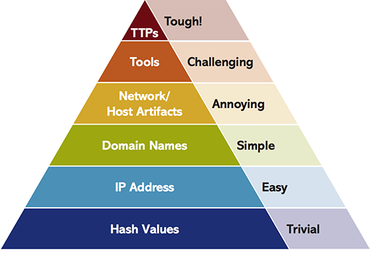
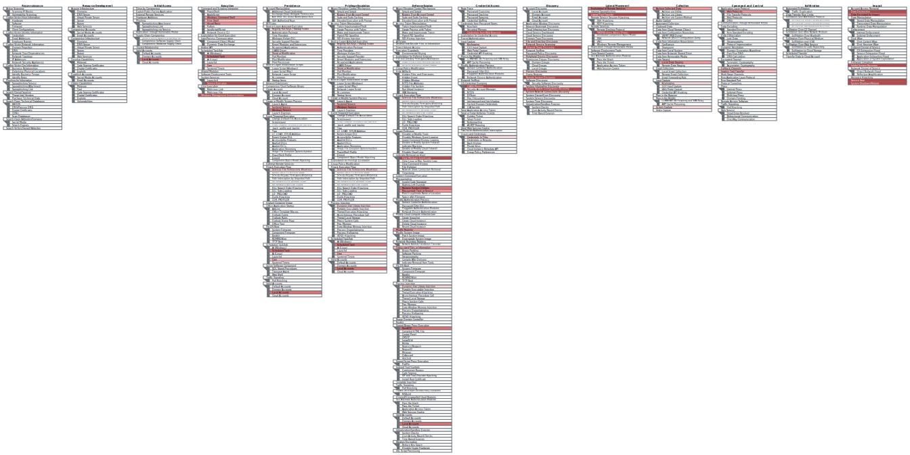
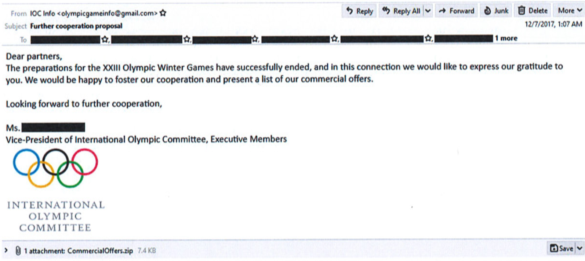

# Pyramid of pain, even for state actors
The "Pyraimd of pain", a concept you might have heard of in InfoSec, essentially suggests that the most difficult indicators of attack for an adversary to change are their TTPs.

Looking through the MITRE ATT&CK groups and their [profile](https://attack.mitre.org/groups/) on the ATT&CK website, I was curious to see how this principle applies to state actors.

Having recently read Andy Greenberg's "Sandworm", which piqued my interest in this subject, the natural choice was to look into the Sandworm profile.

With the [recent indictment](https://www.justice.gov/opa/pr/six-russian-gru-officers-charged-connection-worldwide-deployment-destructive-malware-and) of 6 GRU officers, who were involved in some of the most destructive malware campaigns across the world, as part of the "Sandworm" group, some of the previously reported attributions have been finally acknowledged by the DoJ.

## TTPs

Over the 2015-2018 period, the group used a variery of existing and new components to develop malware for targetted and non-targetted campaigns. These attacks, although varying in types of payloads and exploits used, highlight the fact that even for a state actor, the [pyramid of pain](https://attackiq.com/2019/06/26/emulating-attacker-activities-and-the-pyramid-of-pain/) is still an applicable principle.

A look into the TTPs through the MITRE ATT&CK lense, by overlaying the TTPs used in each attack outlined below shows the concentration of the groups' used methods in certain areas.

_Right Click + View Image to enlarge_

## A look into the tools in each attack

### Dec, 2015: Black Energy, Killdisk, Ukranian Energy
The tools used in this attack were based on Black Energy, originally a DDoS tool ([Black Energy DDoS Bot Analysis, Jose Nazario](./BlackEnergy+DDoS+Bot+Analysis.pdf)). The malware was delivered to the target systems through spearphishing emails. The malware got the attackers remote access and they used Killdisk to wipe out disk contents.

## Dec 2016: Black Energy, Killdisk, Industroyer, Ukranian Ministry of finance and treasury
The attackers once again used a spearphishing campaign to deliver the dropper through an infected excel file to the victims. An updated version of Killdisk was used this time to wipe out evidence and render systems inoperable.

Here is a graph of the IoCs and their relationship I put together, based on what I could gather from VirusTotal and ThreatConnect.

<iframe
  src="https://www.virustotal.com/graph/embed/g69756b568e6f447d8e89d6b0822b2c6e5e106aee2a764c899d5b4708d783601e"
  width="700"
  height="400">
</iframe>

## June 2017: NotPetya
This might have been the most destructive tool the group used. The attack started at a Ukranian accounting firm and spread through the update mechanism for one of the accounting software provided by the company.

The exploits used in this attack were some of the leaked NSA exploits by Shadow Brokers like EternalBlue or EternalRomance.

The estimated damages caused by NotPetya is more than $10 billion. Gavin Ashton has a great insider [story](https://gvnshtn.com/maersk-me-notpetya/) about the impact on Maersk.

Jack Rhysider has a great Darknet Diaries [episode](https://darknetdiaries.com/episode/54/) interviewing Andy Greenberg on this. (Darknet Diaries is an amazing podcast to follow in general)

Eset has a great [article](https://blog.eset.ie/2018/10/12/new-telebots-backdoor-first-evidence-linking-industroyer-to-notpetya/) and research on the similarities between the Industroyer and NotPetya.

## Dec 2017-Feb2018: Olympic Destroyer, Winter Olympics South Korea

The malware used in this attack, dubbed "Olympic Destroyer", was once again delivered through a spearphishing campaign. 

The spearphish email was sent to 220 addresses gathered from the olympic partners page.

Similar attacks continued over the period of Dec 2017-Feb 2018 targetting other olympic related parties, from different senders.

<iframe
  src="https://www.virustotal.com/graph/embed/g90b3b7a6879a437182682a6fce24cbbc5490252785df45579603dcc289123b3b"
  width="700"
  height="400">
</iframe>

This attack went on further to use several different payload types, from zip archives to executables and mobile apps.

[Another](https://darknetdiaries.com/episode/77/) great Darknet Diaries episode on this.

An [article](https://securelist.com/olympic-destroyer-is-still-alive/86169/) from 2018 from Kaspersky labs suggests that the campaign went on to take on a number of other targets till late 2018.

## The team
Looking at the charges against those in the group, one can imagine how the skillset and the experience in the team drives this behavior.
